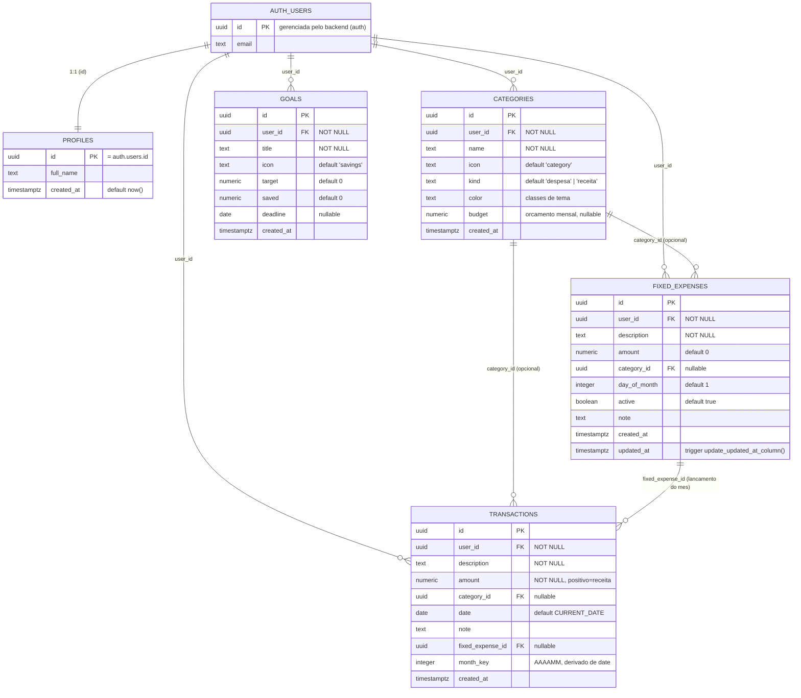

# PersonFinc

Aplicativo de controle financeiro pessoal em português (Brasil), com controle mensal de receitas e despesas, categorias com orçamento, despesas fixas recorrentes e metas de economia. Web app responsivo (mobile-first) empacotável como aplicativo Android via Capacitor.

---

## 1. Visão geral

| Item | Descrição |
| --- | --- |
| Nome | PersonFinc |
| Idioma | pt-BR |
| Público | Pessoa física que quer organizar o orçamento doméstico mês a mês |
| Plataformas | Web (responsivo) e Android (WebView via Capacitor) |
| Autenticação | E-mail/senha e Google, com recuperação e redefinição de senha |

Cada usuário só enxerga os próprios dados — isolamento garantido no banco por Row Level Security.

---

## 2. Stack técnica

**Frontend**

- React 19 + TypeScript
- Vite 7 (build e dev server)
- TanStack Start / TanStack Router (roteamento baseado em arquivos, SSR)
- TanStack Query (cache e invalidação de dados)
- Tailwind CSS v4 — tokens de design declarados em `src/styles.css` (`@theme`)
- shadcn/ui + Radix UI (componentes de base)
- Material Symbols Outlined (ícones) e Inter (tipografia)
- `sonner` para notificações

**Backend**

- Postgres gerenciado (Lovable Cloud), acessado direto do cliente pela Data API
- Autenticação gerenciada (sessão JWT, OAuth Google, fluxos de senha)
- Regras de acesso 100% no banco: RLS + GRANTs por papel
- Funções e triggers em PL/pgSQL para provisionamento de conta e timestamps

**Mobile**

- Capacitor 8 (`@capacitor/core`, `@capacitor/cli`, `@capacitor/android`)
- `capacitor.config.ts` aponta o WebView para a URL publicada da aplicação

---

## 3. Estrutura do projeto

```text
src/
  components/
    app-shell.tsx           layout autenticado: header desktop + bottom nav mobile
    month-selector.tsx      navegação entre meses (AAAAMM)
    transaction-form.tsx    formulário de lançamento
    category-form.tsx       formulário de categoria
    fixed-expense-form.tsx  formulário de despesa fixa
    goal-form.tsx           formulário de meta
    ui/                     componentes shadcn/ui
  lib/
    store.tsx               provider de estado + acesso ao banco (CRUD)
    month.ts                utilitários de mês (chave AAAAMM, rótulos, navegação)
    format.ts               formatação BRL e datas
  integrations/supabase/    cliente e tipos gerados (não editar)
  routes/                   rotas baseadas em arquivos
  styles.css                tokens de tema Tailwind v4
capacitor.config.ts
README-android.md           guia de build/assinatura do APK/AAB
```

### Mapa de rotas

**Públicas**

| Rota | Tela |
| --- | --- |
| `/login` | Entrar e criar conta (e-mail/senha, Google) |
| `/recuperar-senha` | Envio do link de recuperação |
| `/redefinir-senha` | Definição da nova senha |
| `/senha-alterada` | Confirmação de senha alterada |

**Protegidas** (grupo `_authenticated`, com gate de sessão que redireciona para `/login`)

| Rota | Tela |
| --- | --- |
| `/` | Início: seletor de mês, saldo, receitas, despesas e lançamentos recentes |
| `/transacoes` | Lista de lançamentos do mês selecionado |
| `/transacoes/novo` · `/transacoes/:id/editar` | Criar / editar lançamento |
| `/categorias` | Categorias com tipo, ícone e orçamento |
| `/categorias/nova` · `/categorias/:id/editar` | Criar / editar categoria |
| `/fixas` | Despesas fixas e lançamento no mês |
| `/fixas/nova` · `/fixas/:id/editar` | Criar / editar despesa fixa |
| `/metas` | Metas com progresso |
| `/metas/nova` · `/metas/:id/editar` | Criar / editar meta |
| `/perfil` | Dados do usuário e sair da conta |

---

## 4. Modelo de dados



### Descrição das tabelas

- **profiles** — 1:1 com o usuário autenticado (`profiles.id = auth.users.id`). Guarda o nome exibido no app.
- **categories** — categorias do usuário. `kind` define `receita` ou `despesa`; `icon` é um nome de Material Symbol; `color` guarda as classes de tema; `budget` é o orçamento mensal opcional (usado só em despesas).
- **transactions** — lançamentos. `amount` positivo representa entrada e negativo saída; `date` define o período e `month_key` (AAAAMM) é a chave usada nos filtros mensais; `fixed_expense_id` liga o lançamento à despesa fixa que o originou.
- **fixed_expenses** — modelos recorrentes. `day_of_month` é o dia de vencimento, `active` controla se entra na lista de pendentes do mês. Um índice único sobre (despesa fixa, mês) impede lançar a mesma despesa duas vezes no mesmo mês.
- **goals** — metas de economia com valor alvo (`target`), acumulado (`saved`) e prazo opcional (`deadline`).

---

## 5. Segurança

RLS está **habilitado em todas as tabelas do schema público**, com uma política única por tabela:

| Tabela | Política | Comando | Papel | Condição |
| --- | --- | --- | --- | --- |
| `profiles` | own profile | ALL | `authenticated` | `auth.uid() = id` |
| `categories` | own categories | ALL | `authenticated` | `auth.uid() = user_id` |
| `transactions` | own transactions | ALL | `authenticated` | `auth.uid() = user_id` |
| `fixed_expenses` | own fixed expenses | ALL | `authenticated` | `auth.uid() = user_id` |
| `goals` | own goals | ALL | `authenticated` | `auth.uid() = user_id` |

Cada política aplica a mesma expressão em `USING` e `WITH CHECK`, então leitura, inserção, atualização e exclusão ficam restritas ao dono do registro.

Privilégios: `GRANT SELECT, INSERT, UPDATE, DELETE` para `authenticated` e `GRANT ALL` para `service_role`. **Não há acesso anônimo** a nenhuma tabela — sem sessão válida, a API não devolve dados.

### Funções e triggers

- `handle_new_user()` — `SECURITY DEFINER`, disparada na criação de um usuário. Cria o registro em `profiles` e semeia 8 categorias padrão (Salário, Freelance, Mantimentos, Alimentação, Transporte, Moradia, Lazer, Saúde) com ícones, tipos e orçamentos iniciais.
- `update_updated_at_column()` — mantém `updated_at` atualizado em `fixed_expenses`.

### Camada de aplicação

- Grupo de rotas `_authenticated` com gate de sessão: sem sessão, redireciona para `/login`.
- O app escuta mudanças de estado de autenticação e invalida o roteador e o cache de queries em login/logout, evitando dados de sessão anterior em tela.
- Nenhuma chave privada no cliente — apenas a chave publicável.

---

## 6. Funcionalidades

**Controle mensal**

- Seletor de mês no Início e em Transações; todo o resumo é calculado sobre o mês selecionado.
- Indicadores de saldo, total de receitas e total de despesas do período.

**Lançamentos**

- Criar, editar e excluir receitas e despesas com descrição, valor, categoria, data e observação.
- Lista do mês ordenada por data, com ícone e cor da categoria.

**Categorias**

- CRUD completo, com tipo (receita/despesa), ícone Material Symbol, cor de tema e orçamento mensal.
- Acompanhamento do gasto versus orçamento por categoria.

**Despesas fixas**

- Cadastro de despesas recorrentes (descrição, valor, categoria, dia de vencimento, ativa/inativa).
- Lançamento em qualquer mês, individual ou em lote ("lançar pendentes"), sem risco de duplicar no mesmo mês.
- O lançamento gerado vira uma transação normal, editável depois.

**Metas**

- CRUD de metas com valor alvo, valor já guardado, prazo e ícone.
- Barra de progresso com percentual atingido.

**Conta**

- Cadastro e login por e-mail/senha, login com Google, recuperação e redefinição de senha.
- Tela de perfil com dados do usuário e sair da conta.

---

## 7. Rodando localmente

Pré-requisitos: Node.js 20+ e npm (ou bun).

```bash
npm install
npm run dev        # http://localhost:8080
```

Scripts disponíveis:

| Script | O que faz |
| --- | --- |
| `npm run dev` | Servidor de desenvolvimento |
| `npm run build` | Build de produção |
| `npm run build:dev` | Build em modo desenvolvimento |
| `npm run preview` | Servir o build localmente |
| `npm run lint` | ESLint |
| `npm run format` | Prettier |
| `npm run android:sync` | Build web + `cap sync android` |
| `npm run android:open` | Abre o projeto no Android Studio |

As variáveis de ambiente do backend (`VITE_SUPABASE_URL`, `VITE_SUPABASE_PUBLISHABLE_KEY`, `VITE_SUPABASE_PROJECT_ID`) são geradas automaticamente no `.env` e não devem ser editadas à mão.

---

## 8. Build Android

O app Android é um WebView Capacitor que carrega a versão web publicada, configurado em `capacitor.config.ts` (`appId: com.personfinc.app`), com navegação liberada para os domínios de autenticação.

Fluxo resumido: publicar a versão web → `npx cap add android` → `npm run android:sync` → `npm run android:open`.

O passo a passo completo, incluindo geração de keystore, configuração de assinatura e `./gradlew bundleRelease` para o AAB de produção, está em **[`README-android.md`](./README-android.md)**.

---

## 9. Limitações conhecidas

- Sem modo offline: o app depende de conexão com o backend.
- Sem importação/exportação de extratos (OFX/CSV) ou integração bancária.
- Sem relatórios avançados ou gráficos — apenas indicadores mensais e progresso de metas.
- Uma única carteira/conta por usuário.
- Sem notificações push nativas nem lembretes de vencimento.

## 10. Próximos passos sugeridos

- Gráficos de evolução mensal e comparativo entre categorias.
- Exportação de relatórios em CSV/PDF.
- Lembretes de vencimento de despesas fixas via notificação.
- Suporte a múltiplas carteiras e a lançamentos parcelados.
"# personfinc-vercel" 
